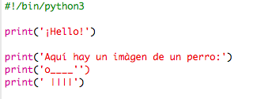
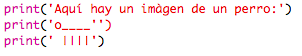
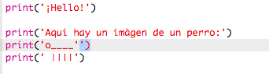
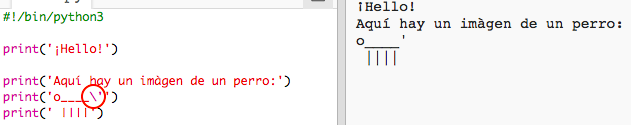
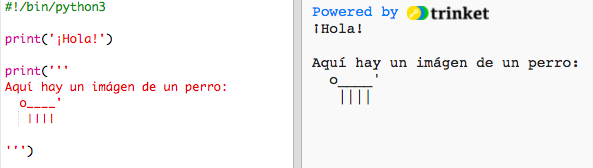

## Arte ASCII

Imprimamos algo más divertido que simple texto, ¡arte ASCII! El arte ASCII (pronunciado '_ask-e_') es la creación de imágenes a partir de texto__.

+ Añadamos un poco de arte a tu programa, ¡la imagen de un perro!

    

+ Al hacer clic en 'run', comprobarás que hay un error en tu nuevo código.

    

    Esto se debe a que tu texto contiene una comilla, ¡y Python cree que es el final del texto!

     

+ Para solucionarlo, simplemente coloca una barra diagonal inversa `\` antes de la comilla en la palabra `here's`. Con ello estarás indicando a Python que la comilla es parte del texto.

    

+ Si lo prefieres, podrás usar 3 comillas `'''` en lugar de 1, permitiéndote imprimir múltiples líneas de texto en una sentencia `print`:

    
