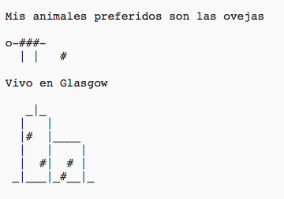

\--- challenge \---

## Reto: sobre ti

Escribe un programa Python contando cosas sobre ti usando texto y arte ASCII. ¡Puedes crear imágenes de tus aficiones, amigos o cualquier otra cosa que prefieras!

**No te olvides de que el código que escribas en Trinket es público. ¡No compartas ningún tipo de información personal como, por ejemplo, tu nombre o dirección!**

Aquí tienes un ejemplo:

\--- /challenge \---