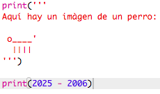
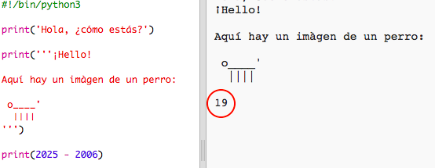
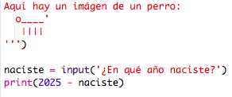
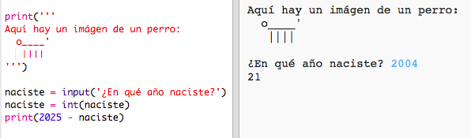
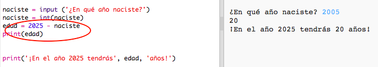
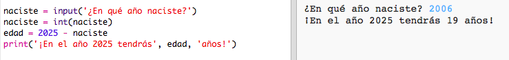

## El año 2025

También puedes hacer cálculos e imprimir números. ¡Averigüemos qué edad tendrás en el año 2025!

+ Para calcular la edad que tendrás en el año 2025, debes restar el año en que naciste a partir de 2025.
    
    Añade este código a tu programa:
    
    
    
    Aviso que no es necesario poner comillas alrededor de los números. (Necesitarás cambiar el número `2006` si naciste en un año diferente.)

+ Haga clic en **Run**, y tu programa debe imprimir tu edad en el año 2025.
    
    

+ Puedes mejorar tu programa usando `input()` para preguntarle al usuario su edad y almacenarla en una **variable** llamado `naciste`.
    
    

+ Ejecute tu programa y luego ingrese el año en que naciste. ¿Recibiste otro mensaje de error?
    
    Eso es porque todo lo que se escribe en tu programa es **texto** y necesita ser convertido a un **número**.
    
    Puedes usar `int()` para convertir el texto a un **entero**. Un entero es un número entero.
    
    

+ También puedes crear otra variable para almacenar su cálculo e imprimirlo en su lugar.
    
    

+ Finalmente, puedes hacer que tu programa sea más fácil de comprender al añadir de un mensaje útil.
    
    