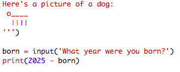
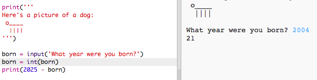

## El año 2025

También podrás realizar cálculos e imprimir números. ¡Comprobemos qué edad tendrás en el año 2025!

+ Para calcular los años que tendrás en el año 2025 necesitas restar a 2025 el año en el que naciste.
    
    Añade este código a tu programa:
    
    
    
    Ten en cuenta que no necesitas poner comillas en los números. (Deberás cambiar el número `2006` si naciste en otro año.)

+ Haz clic en **Run** y tu programa imprimirá la edad que tendrás en el año 2025.
    
    

+ Podrás mejorar tu programa usando `input()` para preguntar al usuario su edad y almacenarla en una **variable** denominada `naciste`.
    
    

+ Ejecuta tu programa y, a continuación, introduce el año en el que naciste. ¿Has recibido otro mensaje de error?
    
    Esto se debe a que todo lo escrito en tu programa es **texto** y necesita ser convertido a **números**.
    
    Usa `int()` para convertir el texto a un **entero**. Un entero es un número sin decimales.
    
    

+ También podrás crear otra variable para almacenar tus cálculos e imprimirlos.
    
    

+ Por último, podrás facilitar la comprensión de tu programa añadiendo un mensaje de ayuda.
    
    