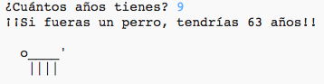

\--- challenge \---

## Reto: tu edad en años de perro

¡Escribe un programa para preguntarle al usuario su edad y luego cuéntales su edad en años de perro! Puedes calcular la edad de una persona en años de perro multiplicando su edad por 7.

En la programación, el símbolo para la **multiplicación** es el carácter `*`, que generalmente puede escribir presionando las teclas <kbd>Shift + 8</kbd> en el teclado.

\--- /challenge \---