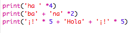
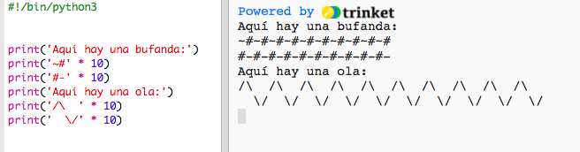

--- challenge ---

## Desafío: calcular texto

¡¿Sabías que también puedes calcular texto?!

¿Qué imprimirá el siguiente programa en la pantalla? Intenta adivinar la respuesta correcta antes de ejecutar el programa.

¿Eres capaz de inventarte palabras? ¡Puedes incluso crear tus propios patrones!

--- /challenge ---

***

### Traducción aportada por la comunidad

Este proyecto fue traducido por **Josie Hough** y revisado por **Pablo Abad**. Nuestros increíbles voluntarios de traducción nos ayudan a dar a los niños de todo el mundo la oportunidad de aprender a programar. Puedes ayudarnos a llegar a más niños traduciendo nuestros proyectos. Consigue más información en [rpf.io/translators](http://rpf.io/translators).
