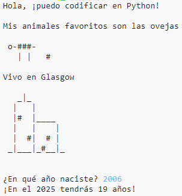

## Introducción

En este proyecto aprenderás a escribir un programa en Python contándole a los demás sobre ti.

### Lo que harás

  <iframe src="https://trinket.io/embed/python/2acae10822?outputOnly=true&start=result" width="600" height="500" frameborder="0" marginwidth="0" marginheight="0" allowfullscreen>
  </iframe>
  

### Lo que aprenderás

Este proyecto incluye elementos de los siguientes temas del [Currículo de creación digital de Raspberry Pi](http://rpf.io/curriculum){:target="_blank"}:

+ [Utiliza estructuras básicas de programación para crear programas simples](https://www.raspberrypi.org/curriculum/programming/creator){:target="_blank"}

### Información adicional para educadores

Si necesitas imprimir este proyecto, utiliza la [versión para imprimir](https://projects.raspberrypi.org/es-LA/projects/about-me/print){:target="_blank"}.

Utiliza el link que aparece en el pie de página para acceder al repositorio de GitHub de este proyecto que contiene todos los recursos (incluyendo un ejemplo de un proyecto terminado) en la carpeta 'es-LA/resources'.