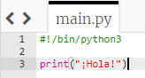
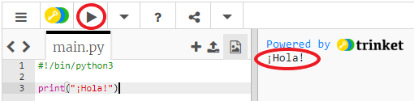
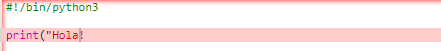
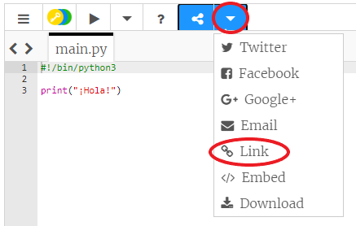
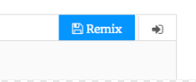

## Aprendiendo a saludar

Empecemos por escribir un texto.

+ Abre la plantilla en blanco de Python en Trinket: <a href="http://jumpto.cc/python-new" target="_blank">jumpto.cc/python-new</a>.

+ Escribe lo siguiente en la ventana que aparece:
    
    
    
    La línea `#!/bin/python3` simplemente avisa a Trinket que estamos usando Python 3 (la última versión).

+ Haz clic en **Run** y deberías ver que el comando `print()` imprime todo lo que se encuentra entre comillas `''`.
    
    

Si te equivocas, ¡recibirás un mensaje de error indicándote qué salió mal!

+ ¡Inténtalo! Borra la última comilla `'` o el paréntesis final `)` (o ambos) y ve qué pasa.
    
    

+ Vuelve a escribir la comilla o el paréntesis y haz clic en **Run** para asegurarte de que el proyecto funciona correctamente.

**¡No necesitas una cuenta en Trinket para guardar tus proyectos!**

Si no tienes una cuenta en Trinket, haz clic en la tecla flecha hacia abajo y luego en **Link**. Obtendrás un link que podrás guardar y al que podrás regresar más tarde. ¡Deberás hacer esto cada vez que realices cambios ya que el enlace cambiará!

Si tienes una cuenta en Trinket, puedes hacer clic en **Remix** para guardar tu propia copia del trinket.

