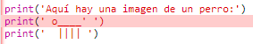

## Arte ASCII

Imprimamos algo mucho más divertido que texto: ¡arte ASCII! El arte ASCII (pronunciado '*ask-e*') está creando **imágenes a partir de texto**.

+ Añadamos un poco de arte a tu programa, ¡la imagen de un perro!
    
    

Las patas del perro se hacen usando el carácter de barra vertical `|` que se puede escribir presionando <kbd>Shift + \ </kbd> en la mayoría de teclados en inglés de UK/US.

+ Si haces clic en **Run**, verás que hay un error en tu nuevo código.
    
    
    
    ¡Eso es porque tu texto tiene un apóstrofo `'` y Python cree que es el final del texto!
    
    

+ Para solucionar esto, simplemente coloca una barra invertida `\` antes de la comilla que forma la cola del perro `'`. Esto le dice a Python que el apóstrofo es parte del texto.
    
    

+ Si prefieres, puedes usar tres apóstrofos `'''` en lugar de uno. Esto te permitirá imprimir varias líneas de texto de una oración `print`:
    
    