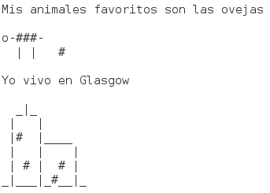

\--- challenge \---

## Desafío: sobre ti

Escribe un programa en Python para contarle a los demás sobre ti utilizando texto y arte ASCII. ¡Puedes crear imágenes de tus pasatiempos, amigos o lo que tú quieras!

**Recuerda que el código que escribas en Trinket es público. ¡No compartas ningún tipo de información personal como tu nombre completo o dirección!**

Aquí tienes un ejemplo:

\--- /challenge \---