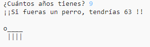

--- challenge ---

## Desafío: tu edad en años de perro

¡Escribe un programa para preguntarle al usuario su edad y luego dile su edad en años de perro! Puedes calcular la edad de una persona en años de perro multiplicándola por 7.

En programación, el símbolo para **multiplicación** es el carácter `*`, que puedes escribir presionando <kbd>Shift + +</kbd> en el teclado.

--- /challenge ---