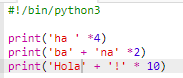
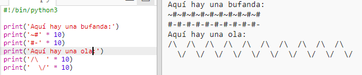

\--- challenge \---

## Desafío: calculando texto

¡¿Sabías que también puedes calcular texto?!

¿Qué imprimirá el siguiente programa en tu pantalla? Intenta adivinar correctamente antes de ejecutar el programa.

¿Podrías inventar tus propias palabras? ¡Incluso puedes crear tus propios patrones!

\--- /challenge \---