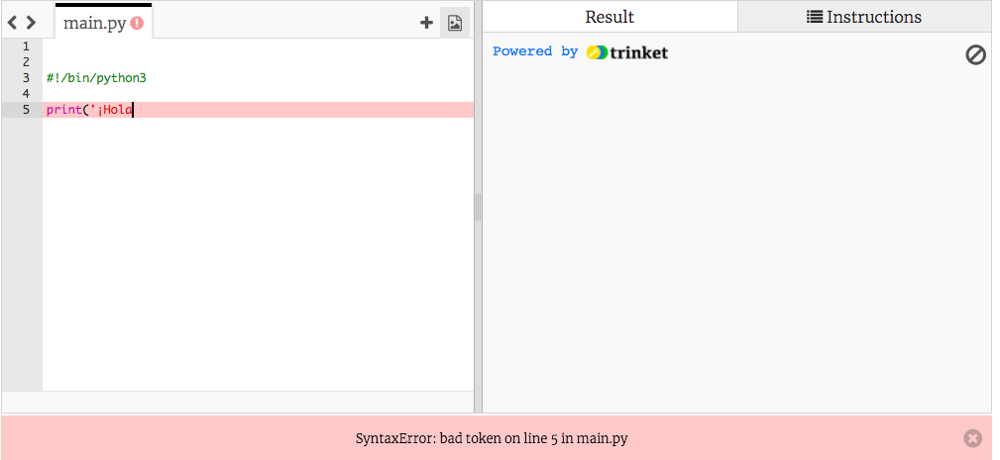
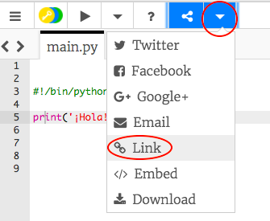

## Decir hola

Empecemos por escribir un texto.

+ Abre el Trinket de la plantilla en blanco de Python: <a href="http://jumpto.cc/python-new" target="_blank">jumpto.cc/python-new</a>.

+ Escribe lo siguiente en la ventana que aparece:
    
    
    
    La línea `#!/bin/python3` simplemente dice a Trinket que estamos usando Python 3 (la última versión).

+ Haz clic en **Run**, y deberías ver que el comando `print()` imprime todo entre comillas `''`.
    
    

Si cometes un error, ¡recibirás un mensaje de error indicándote lo qué salió mal!

+ Try it! Delete the end quote `'` or the closing bracket `)` (or both) and see what happens.
    
    

+ Vuelve a escribir la comilla o el paréntesis, y haz clic en **Run** para asegurarte de que el proyecto vuelve a funcionar correctamente.

**¡No necesitas una cuenta de Trinket para guardar sus proyectos!**

Si no tienes una cuenta de Trinket, haz clic en la flecha hacia abajo y haz clic en **Link**. Obtendrás un enlace que podrás guardar y al que podrás regresar más tarde. ¡Deberás hacer esto cada vez que realices cambios, ya que el enlace cambiará!

Si tienes una cuenta de Trinket, puedes hacer clic en **Remix** para guardar tu propia copia del trinket.

