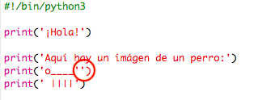
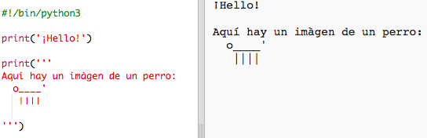

## Arte ASCII

Imprimamos algo más divertido que simple texto, ¡arte ASCII! El arte ASCII (pronunciado '*ask-i*') crea **imágenes a partir de texto**.

+ Añadamos un poco de arte a tu programa, ¡la imagen de un perro!
    
    

Las patas del perro se hacen usando el carácter `|` que se puede escribir tecleando <kbd>Shift + \</kbd> en la mayoría de teclados ingleses del Reino Unido/de los Estados Unidos.

+ Si haz clic en **Run**, verás que hay un error en tu nuevo código.
    
    
    
    ¡Eso es porque el texto contiene un apóstrofo `'`, que Python cree es el final del texto!
    
    

+ To fix this, just put a backslash `` before the apostrophe in the word `here's`. This tells Python that the apostrophe is part of the text.
    
    

+ If you prefer, you can use three apostrophe `'''` instead of one, which allows you to print multiple lines of text with one `print` statement:
    
    