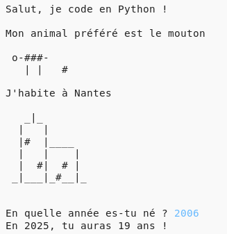

## Introduction

Dans ce projet, tu apprendras à écrire un programme Python qui te dira tout sur toi.

### Ce que tu créeras

  <iframe src="https://trinket.io/embed/python/a1f663ae0d?outputOnly=true&start=result" width="600" height="500" frameborder="0" marginwidth="0" marginheight="0" allowfullscreen>
  </iframe>
  

### Ce que tu apprendras

Ce projet couvre les éléments suivantes des sections du curriculum [ Raspberry Pi Digital Making](http://rpf.io/curriculum){: target = "_ blank"}:

+ [ Utilise des concepts de base de programmation créer des programmes simples ](https://www.raspberrypi.org/curriculum/programming/creator) {: target = "_ blank"}

### Informations supplémentaires pour les éducateurs

Si tu as besoin d'imprimer ce projet, merci d'utiliser la [Version imprimable](https://projects.raspberrypi.org/en/projects/about-me/print) {: target = "_ blank"}.

Use the link in the footer to access the GitHub repository for this project, which contains all resources (including an example finished project) in the 'en/resources' folder.