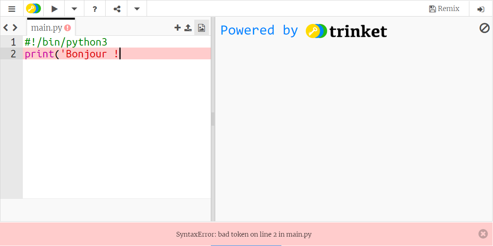

## Dire Bonjour

Commençons par écrire un peu de texte.

+ Ouvre le modèle de Trinket Python: <a href="http://jumpto.cc/python-new" target="_blank">jumpto.cc/python-new</a>.

+ Tape ce qui suit dans la fenêtre qui apparaît:

    

    La ligne `#!/bin/python3` indique simplement à Trinket que nous utilisons Python 3 (la version la plus récente).

+ Clique sur **Run** et tu devrais voir que la commande `print()` affiche tout ce qui est inclus à l'intérieur des apostrophes `''`.

    

+ Si tu fais une erreur, tu verras un message d'erreur à la place, t'indiquant ce qui n'a pas fonctionné!

+ Essaie le! Supprime la dernière apostrophe `'` ou la parenthèse de fin `)` (ou les deux) et regarde ce qui se produit.

    

+ Replace l'apostrophe `'` ou la parenthèse `)` puis clique sur **Run** pour t'assurer que ton projet fonctionne à nouveau.

__Tu n'as pas besoin d'un compte Trinket pour sauvegarder ton projet!__

Si tu n'as pas de compte Trinket, clique sur le bouton de menu en haut à gauche puis clique **Link**. Ceci te donnera un lien que tu peux sauvegarder pour y revenir plus tard. Tu devras faire ceci à chaque fois que tu fais des changements puisque le lien changera.

Si tu as un compte Trinket, tu peux cliquer **Remix** pour sauvegarder ta propre copie du Trinket.

