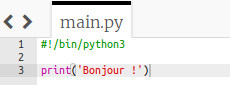
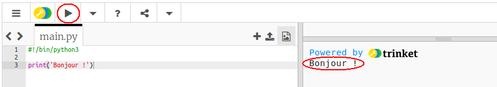
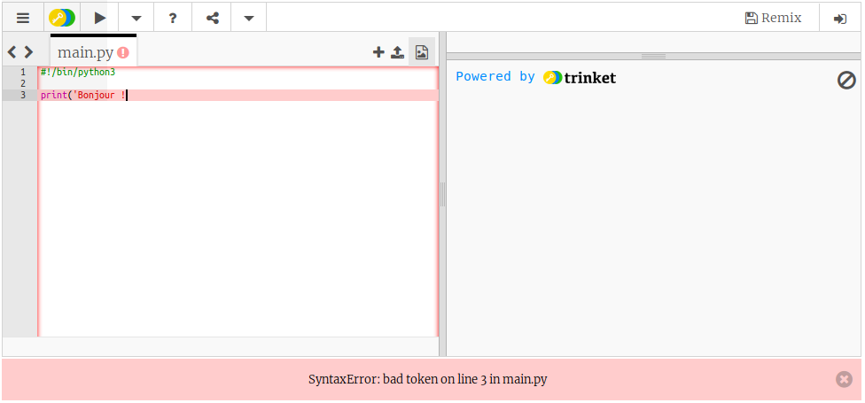
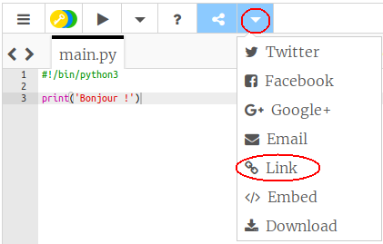

## Dire bonjour

Commençons par écrire du texte.

+ Ouvre le modèle de Trinket Python vierge : <a href="http://jumpto.cc/python-new" target="_blank">jumpto.cc/python-new</a>.

+ Tape le texte suivant dans la fenêtre qui apparaît:
    
    
    
    La ligne ` #! / Bin / python3 ` précise juste à Trinket que nous utilisons Python 3 (la version la plus récente).

+ Clique sur ** Exécuter ** , et tu devrais voir que la commande ` print () ` imprime tout ce qui est entre les guillemets ` '' ` .
    
    

Si tu as fait une erreur, tu recevras un message d'erreur t'indiquant ce qui n'a pas marché !

+ Essaye! Supprime l'apostrophe de fin ` ' ` ou la parenthèse de fermeture `) ` (ou les deux) pour voir ce qui se passe.
    
    

+ Ajoute l'apostrophe ou le crochet à nouveau et clique sur ** Exécuter ** pour t'assurer que ton projet fonctionne à nouveau.

**Tu n'as pas besoin d'un compte Trinket pour sauvegarder tes projets!**

If you don't have a Trinket account, click the down arrow and then click **Link**. This will give you a link that you can save and come back to later. You'll need to do this every time you make changes, as the link will change!

If you have a Trinket account, you can click **Remix** to save your own copy of the trinket.

