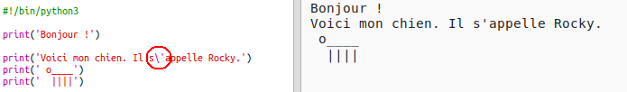

## Art ASCII

Affichons quelque chose de plus amusant que du texte... De l'art ASCII (prononcé "_aski_") consiste à créer des __images à l'aide de texte__.

+ Ajoutons un peu d'art à ton programme - l'image d'un chien!

    

+ Si tu cliques sur **Run**, tu verras qu'il y a un "bug" dans ton nouveau code.

    

    C'est parce que ton texte contient deux apostrophes et Python croit qu'elles indiquent les limites du texte!

    

+ Pout régler ce problème, ajoute simplement une barre oblique inverse `\` devant l'apostrophe dans les mots `l'image` et `d'un`. Ceci indique à Python que l'apostrophe fait partie du texte.

    

+ Si tu préfères, tu peux utiliser trois apostrophes `'''` au lieu d'une, ce qui te permet d'afficher plusieurs lignes de texte avec une seule instruction `print()`:

    
