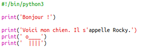
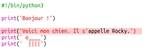
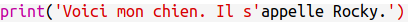
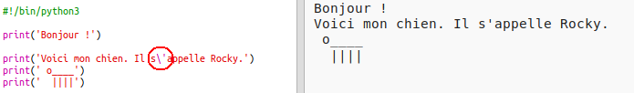
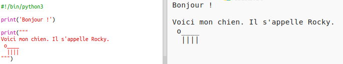

## Art ASCII

Let’s print something much more fun than text: ASCII art! L'Art ASCII (prononcé '* ask-i * ') crée ** des images à partir de texte ** .

+ Ajoutons un peu d'art à ton programme - une photo d'un chien!
    
    

Les jambes du chien sont fabriqués à partir du caractère barre verticale `|` que tu peux saisir en appuyant sur <kbd>Shift + \</kbd> sur la plupart des claviers anglais ou américains.

+ Si tu cliques sur ** Exécuter ** , tu verras qu'il y a un bug dans ton nouveau code.
    
    
    
    C'est parce que ton texte contient une apostrophe ` ' ` que Python pense que c'est la fin du texte!
    
    

+ Pour corriger cela, il suffit de mettre une barre oblique inverse ` \ ` avant l'apostrophe dans le mot ` ici ` . Cela indique à Python que l'apostrophe fait partie du texte.
    
    

+ If you prefer, you can use three apostrophes `'''` instead of one, which allows you to print multiple lines of text with one `print` statement:
    
    