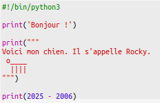
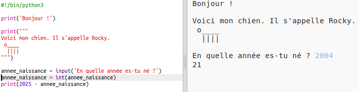
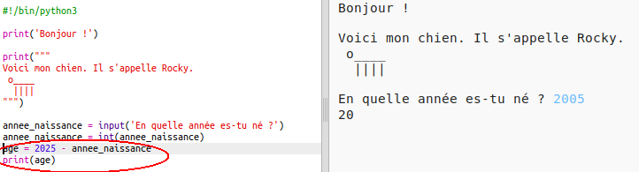

## The year 2025

Tu peux aussi faire des calculs et afficher des nombres. Trouvons quel âge tu auras en l'an 2025.

+ Pour calculer l'âge que tu auras en l'an 2025, tu dois soustraire l'année de ta naissance de 2025.

    Ajoute ce code à ton programme:

    

    Remarque que tu n'as pas besoin de mettre d'apostrophes `''` autour des nombres.

    (Tu devra changer le nombre `2006` si tu es né(e) une année différente.)

+ Clique "Run". Ton programme devrait afficher ton age en l'an 2025.

    

+ Tu pourrais améliorer ton programme en utilisant `input()` pour demander à l'usager son age et le stocker dans une __variable__ appelée `naissance`.

    

+ Exécute ton programme puis entre l'année de ta naissance. As-tu eu une nouvelle erreur?

    C'est parce que tout ce que tu tapes dans ton programme est du __texte__ et tu dois le convertir en un __nombre__.

    Tu peux utiliser la fonction `int()` pour convertir le texte en un __nombre entier__ ("int" pour "integer" signifie nombre entier en anglais).

    

+ Tu peux aussi créer une autre variable pour stocker le résultat de ton calcul et afficher celle-ci à la place.

    

+ Finalement, tu peux rendre ton programme plus facile à comprendre en y ajoutant un message utile.

    