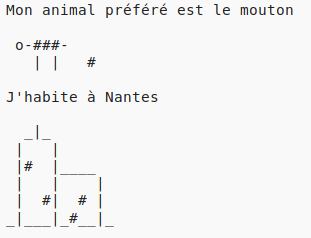

\--- Défi\---

## Défi: à propos de toi

Écris un programme Python pour parler aux autres de toi en utilisant du texte et de l'art ASCII. Tu créer des images de tes passe-temps, amis, ou de tout ce que tu aimes!

**Remember that the code you write in Trinket is public. Don't share any personal information like your full name or address!**

Here’s an example:

\--- /challenge \---