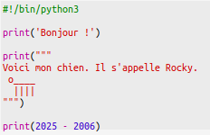
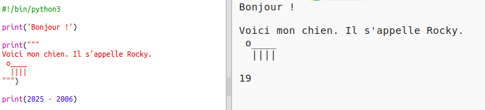
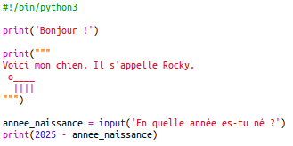
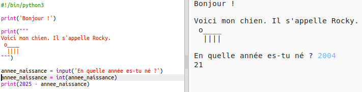
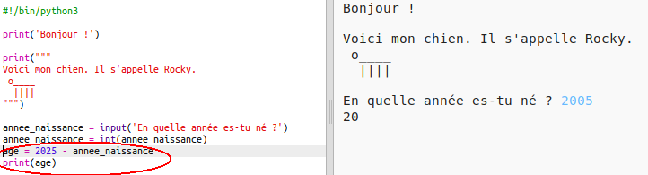
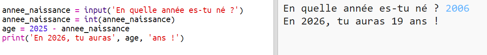

## L'année 2025

Tu peux également faire des calculs et imprimer des numéros. Voyons voir quel âge tu auras en 2025!

+ Pour calculer ton âge en 2025, tu devras soustraire l'année de naissance à 2025.
    
    Ajoutez ce code à ton programme:
    
    
    
    Note que tu n'as pas besoin de placer des guillemets autour des nombres. (Tu devras changer le numéro ` 2006 ` si tu es né une autre année)

+ Click **Run**, and your program should print your age in the year 2025.
    
    

+ You could improve your program by using `input()` to ask the user their age and store it in a **variable** called `born`.
    
    

+ Run your program and then enter the year you were born. Did you get another error messgae?
    
    That's because anything typed into your program is **text**, and it needs to be converted to a **number**.
    
    You can use `int()` to convert the text to an **integer**. An integer is a whole number.
    
    

+ You can also create another variable to store your calculation, and print that instead.
    
    

+ Finally, you can make your program easier to understand by adding a helpful message.
    
    