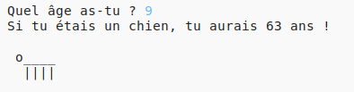

--- challenge ---
## Défi: Ton âge en années de chien
Écris un programme qui demande à l'usager son âge puis lui dit son age en années de chien! Tu peux calculer l'âge d'une personne en années de chien en multipliant son âge par 7.

En programmation, le symbole de __multiplication__ est `*` et correspond généralement à __maj+8__ (shift+8) sur le clavier.

--- /challenge ---
