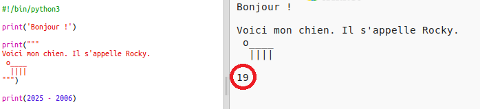

## L'année 2025

Tu peux également faire des calculs et imprimer des numéros. Voyons voir quel âge tu auras en 2025!

+ Pour calculer ton âge en 2025, tu devras soustraire l'année de naissance à 2025.
    
    Ajoutez ce code à ton programme:
    
    
    
    Note que tu n'as pas besoin de placer des guillemets autour des nombres. (Tu devras changer le numéro ` 2006 ` si tu es né une autre année)

+ Clique sur **Run**, et ton programme devrait imprimer ton âge en 2025.
    
    

+ Tu peut améliorer ton programme en utilisant `input()` pour demander à l'utilisateur son âge et le stocker dans une **variable** appelée `born`.
    
    

+ Exécutez ton programme et entre ensuite l’année où tu es né. As-tu reçu un autre message d’erreur ?
    
    C'est parce que tout ce qui est tapé dans ton programme est du **texte**, et il doit être converti en **nombres**.
    
    Tu peux utiliser `int()` pour convertir le texte en un **entier**. Un entier est un nombre entier.
    
    

+ Tu peux également créer une autre variable pour stocker ton calcul et l'imprimer à la place.
    
    

+ Finally, you can make your program easier to understand by adding a helpful message.
    
    