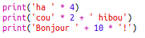
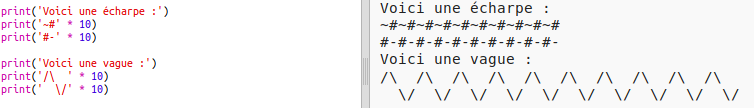

--- challenge ---
## Défi: calculer du texte
Savais-tu que tu pouvais aussi "calculer" du texte?!

Qu'est-ce que le programme suivant affiche à l'écran? Essaie de deviner avant d'exécuter le programme.

Peux-tu composer tes propres mots de cette manière? Tu pourrais même créer tes propres motifs!

--- /challenge ---
