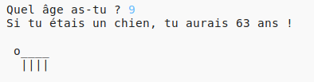

--- challenge ---

## Défi: ton âge en années de chien

Écris un programme pour demander à l'utilisateur son âge, puis affiche son âge en années de chien! Tu peux calculer l’âge d’une personne en années de chien en multipliant son âge par 7.

En programmation, le symbole **multiplication** est le caractère `*`.

--- /challenge ---