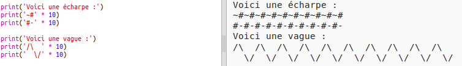

\--- défi \---

## Défi : calculer du texte

Savais-tu que tu peux aussi calculer du texte ?!

Qu'est-ce que le programme suivant imprimera à l'écran ? Regarde si tu peux le deviner correctement avant d'exécuter le programme.

Peux-tu inventer tes propres mots ? Tu peux même faire tes propres modèles !

\--- /challenge \---