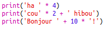

--- challenge ---

## Défi: calculer du texte

Savais-tu que tu peux aussi calculer du texte?!

Qu'est-ce que le programme suivant affichera à l'écran? Essaye de deviner le résultat avant d'exécuter le programme.

Peux-tu inventer tes propres mots ? Tu peux même faire tes propres motifs!

--- /challenge ---

**Traduction de la communauté**

Ce projet a été traduit par **Jonathan Virga** et vérifié par **Simon Gleises**.

Nos incroyables bénévoles de traduction nous aident à donner aux enfants du monde entier la chance d'apprendre à coder. Vous pouvez nous aider à atteindre plus d'enfants en traduisant nos projets - en savoir plus sur [rpf.io/translators](https://rpf.io/translators).