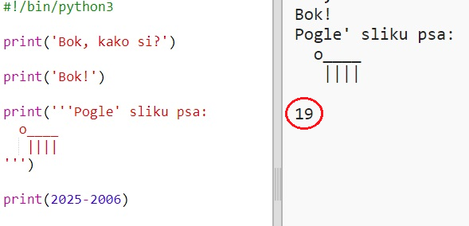
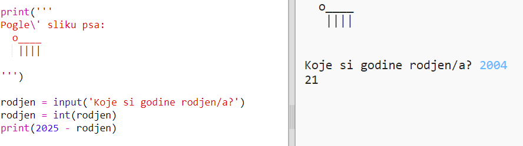
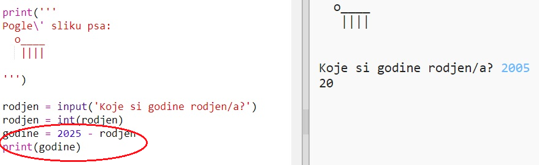

## 2025. godina

Možeš i računati i ispisivati brojeve. Saznajmo koliko godina ćeš imati 2025. godine!

+ Da bi izračunao koliko godina ćeš imati 2025. godine, moraš oduzeti godinu svog rođenja od 2025.
    
    Dodaj ovaj kôd svom programu:
    
    
    
    Primijetit ćeš da se brojevi ne pišu unutar znakova navodnika. (Promijeni broj `2006` ako si rođen neke druge godine.)

+ Klikni na **Run** i tvoj program bi trebao ispisati koliko ćeš imati godina 2025. godine.
    
    

+ Možeš poboljšati svoj program koristeći naredbu `input()` kako bi pitao korisnika koliko ima godina. Odgovor je spremljen u **varijablu** `rodjen`.
    
    

+ Pokreni program i unesi godinu svog rođenja. Jesi li opet dobio poruku o grešci?
    
    To je zato jer je sve što uneseš u svoj program **tekst** i treba ga pretvoriti u **broj**.
    
    Možeš koristiti naredbu `int()` da bi promijenio tekst u oblik **integer**. Integer je cijeli broj.
    
    

+ Možeš i dodati novu varijablu za spremanje svog izračuna, a zatim nju ispisati.
    
    

+ Konačno, svoj program možeš učiniti razumljivijim za korisnike, sa par jednostavnih dodatnih poruka.
    
    