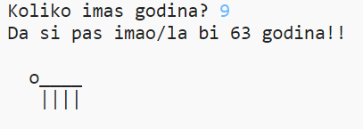

--- challenge ---

## Izazov: Koliko imaš psećih godina?

Napiši program koji korisnika pita da unese svoje godine, a zatim mu ispiše njegove pseće godine! Kako bi izračunao koliko osoba ima psećih godina, pomnoži njihove godine sa 7.

U programiranju je simbol za **množenje** `znak *` i obično ga možemo ispisati ako stisnemo <kbd>Shift i znak +</kbd> na tipkovnici.

--- /challenge ---
