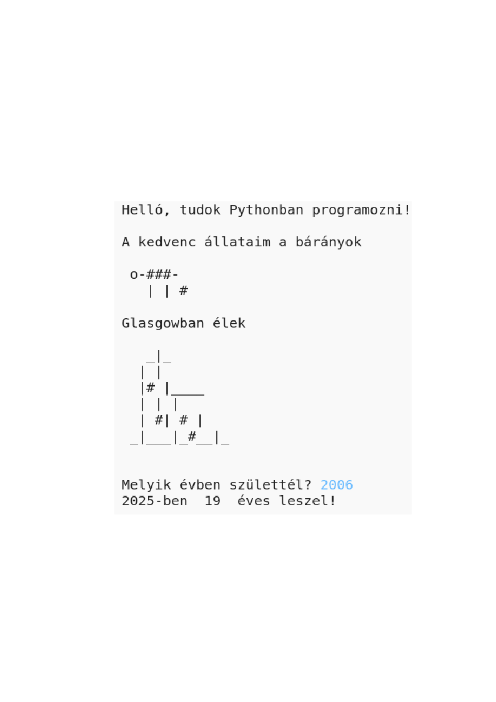

## Bevezetés

Ebben a projektben megtanulhatod, hogyan kell írni egy Python programot, amely az embereket rólatok szólítja.

### Mit fogsz csinálni?

  <iframe src="https://trinket.io/embed/python/a1f663ae0d?outputOnly=true&start=result" width="600" height="500" frameborder="0" marginwidth="0" marginheight="0" allowfullscreen>
  </iframe>
  

### Amit megtanulsz

Ez a projekt a [Raspberry Pi Digitális készítési tanterv](http://rpf.io/curriculum){: target = "_ blank":

+ [egyszerű programozási konstrukciókat egyszerű programok létrehozásához](https://www.raspberrypi.org/curriculum/programming/creator){: target = "_ blank"}

### További információk az oktatók számára

Ha ki kell nyomtatnia ezt a projektet, kérjük, használja a [nyomtatóbarát](https://projects.raspberrypi.org/en/projects/about-me/print)verziót {: target = "_ blank"}.

Használja a láblécben lévő linket a GitHub tárhely eléréséhez ehhez a projekthez, amely tartalmazza az "en / resources" mappában található összes erőforrást (beleértve egy befejezett példát is).