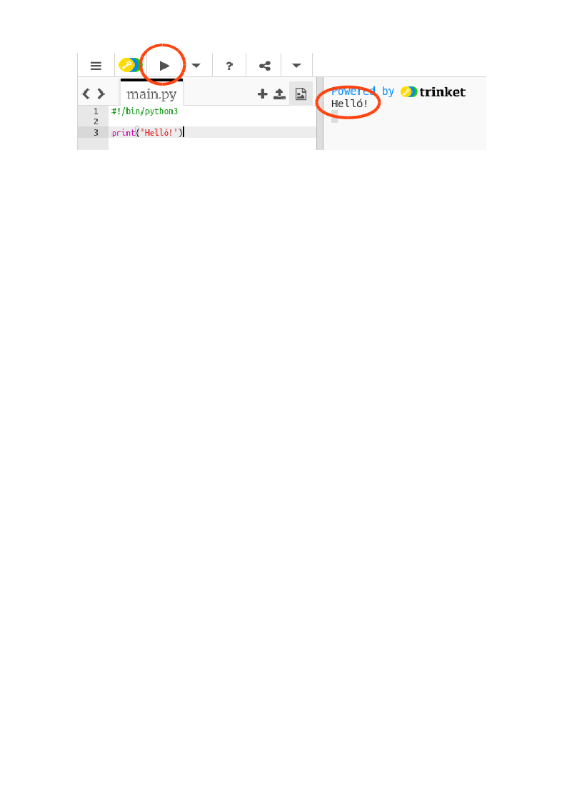
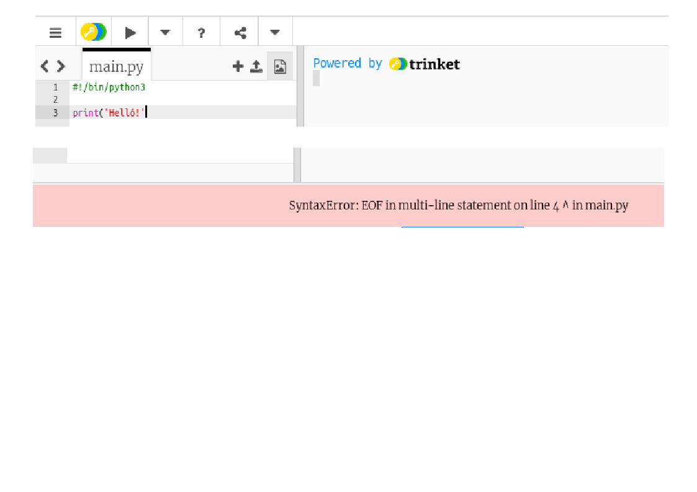
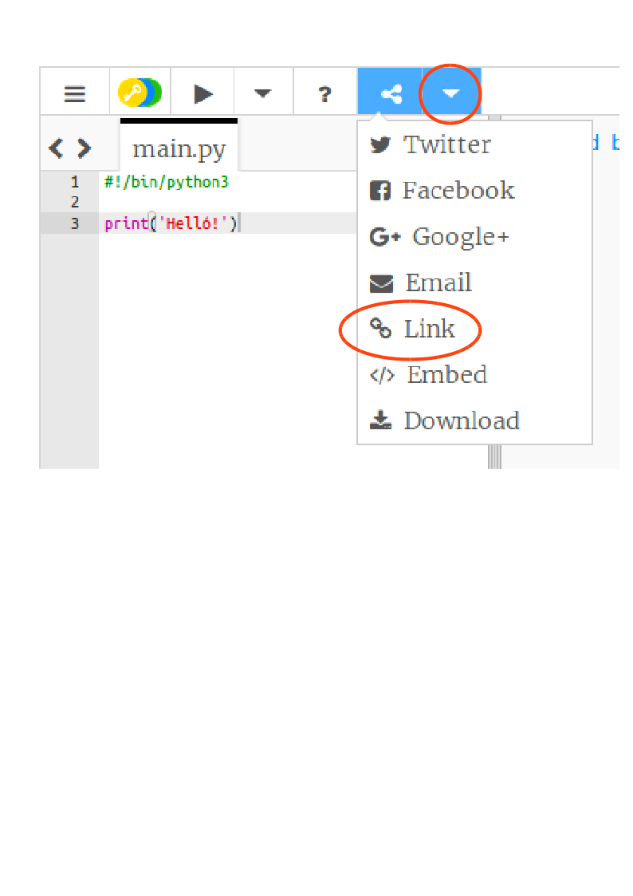

## Köszönni

Kezdjük azzal, hogy néhány szöveget írunk.

+ Nyissa meg az üres Python sablon cédulát: <a href="http://jumpto.cc/python-new" target="_blank">jumpto.cc/python-new</a>.

+ Írd be a következőt a megjelenő ablakba:
    
    
    
    A `#! / Bin / python3` csak azt mondja a Trinketnek, hogy a Python 3-at (a legújabb verzió) használjuk.

+ Kattints a ****futtatásra, és látni fogod, hogy a `print ()` parancs mindent kinyomtat az `''` aposztrófok között.
    
    

Ha hibáztál, egy hibaüzenet jelenik meg, amely megmondja, mit rontottál el!

+ Próbáld ki! Töröld ki az aposztrófot `'` vagy a zárójelet `)` (vagy mindkettőt), és nézd meg, mi történik.
    
    

+ Add hozzá aposztrófot vagy zárójelet, és kattints a **** Futtatásra, hogy meggyőződj arról, hogy a projekt újra működik.

**Nem kell Trinket fiók, hogy elmentsd a projekteket!**

Ha nincs Trinket-fiókja, kattintson a lefelé mutató nyílra, majd kattintson a **Link**elemre. Ez egy olyan linket ad Önnek, amelyet menthet és később visszatérhet. Mindig ezt meg kell tennie, amikor módosítja a változtatásokat, ahogy a link megváltozik!

Ha van Trinket-fiókod, akkor kattints a **Remix** hogy mentse a csecsebecsék saját példányát.

