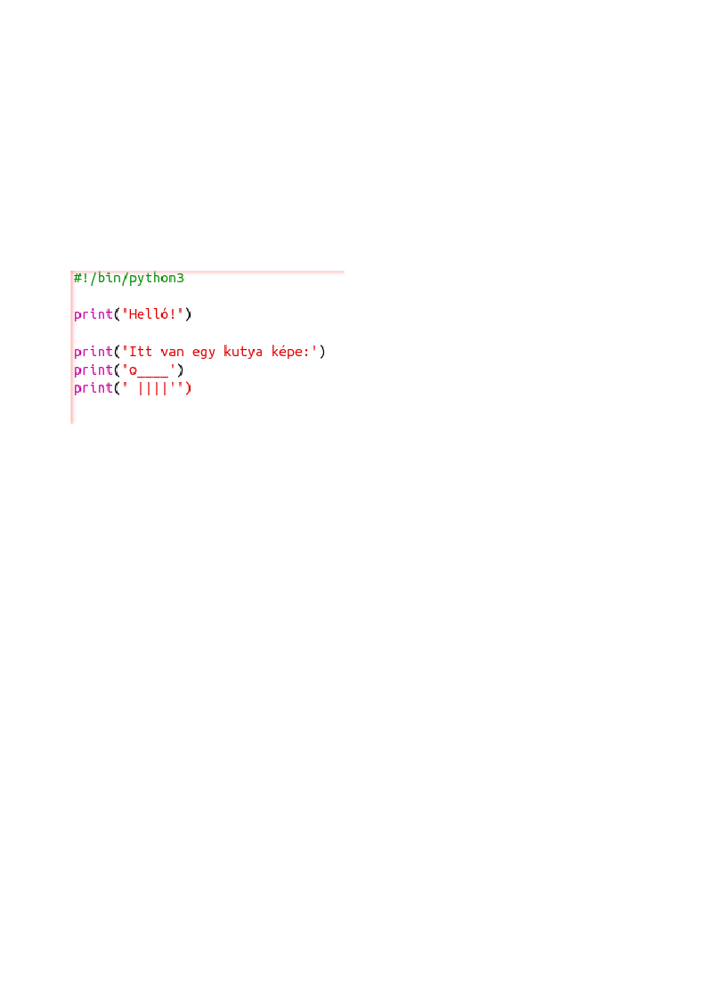
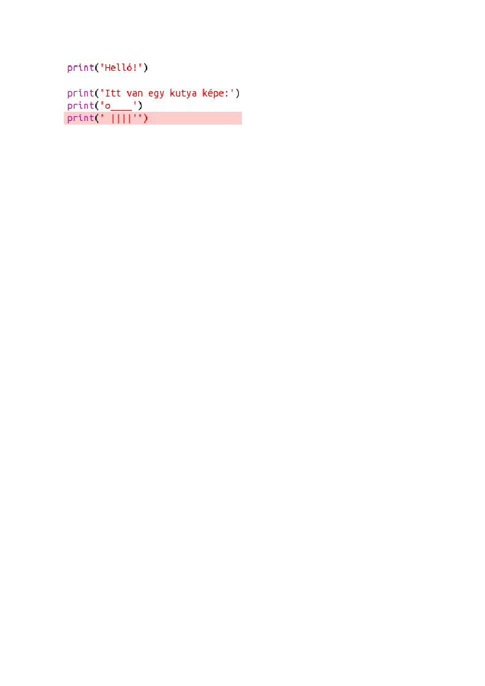
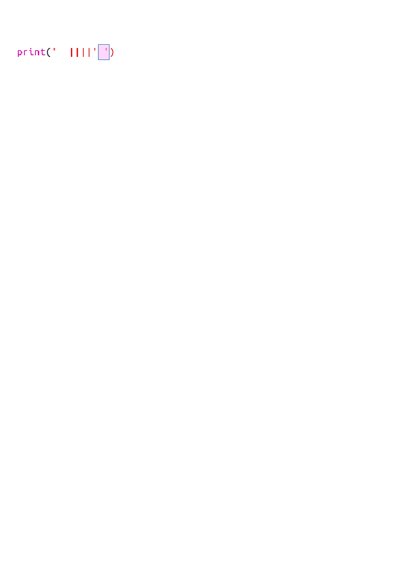
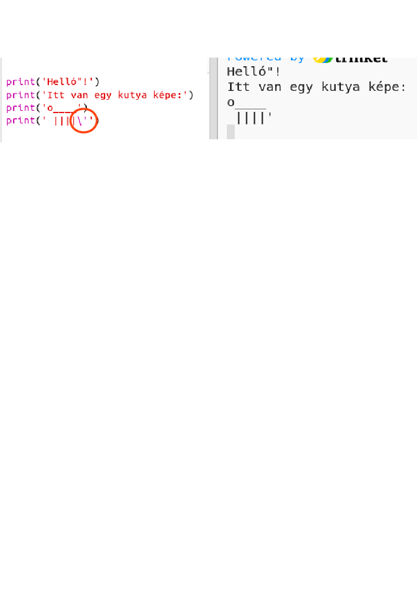
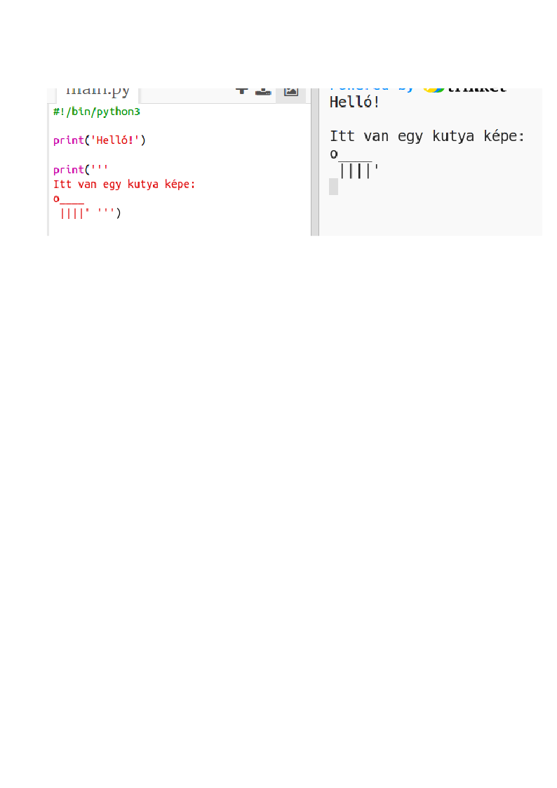

## ASCII művészet

Írjunk ki valami sokkal szórakoztatóbb szöveget, mint a szöveg: ASCII art! ASCII art ("*eszkii-art*") **képet alkot a szövegből**.

+ Adjunk hozzá egy kis művészetet a programhoz - egy kutya képét!
    
    

A kutya lába a `| cső karakterrel készül` amely beírhatja megnyomásával <kbd>Shift + \ </kbd> A legtöbb brit / amerikai angol billentyűzetet.

+ Ha a ****futtatásra kattint, látni fogja, hogy van egy hiba az új kódban.
    
    
    
    Ez azért van, mert a szöveged `'`apostropétt tartalmaz, melyet Python a szöveg vége!
    
    

+ Ezt kijavítani, csak egy `3_1_321 visszafordulót állítson be, mielőtt az apostropé a <code>itt`. Ez azt mondja Pythonnak, hogy az apostrófa a szöveg része.
    
    

+ Ha úgy tetszik, használhat három helyett `'' '` apostrofot, amely lehetővé teszi több szövegsor nyomtatását egy `print` utasítással:
    
    