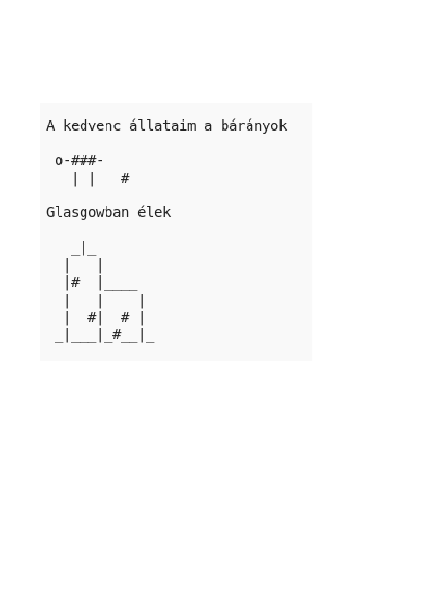

\--- kihívás \---

## Kihívás: magadról

Írj egy Python programot, hogy elmondd másoknak magadról a szöveget és az ASCII művészetet. Képeket készíthet hobbiról, barátaidról vagy bármi másról, amik tetszenek!

**Ne feledje, hogy a Trinket-ben írt kód nyilvános. Ne ossz meg olyan személyes adatokat, mint a teljes neved vagy címed!**

Íme egy példa:

\--- / kihívás \---