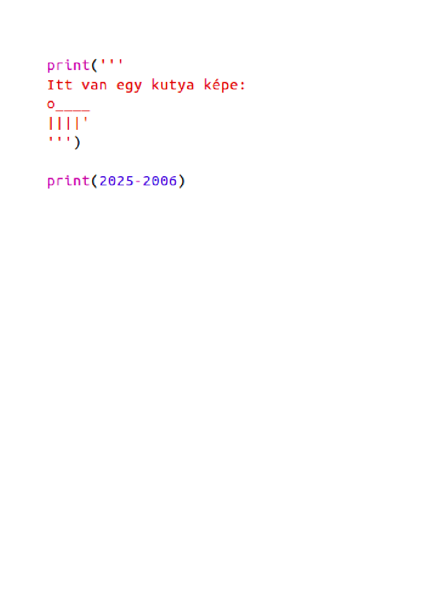

## A 2025-ös év

Számításokat és számkiíratásokat is elvégezhetsz. Nézzük meg hány éves leszel 2025-ben!

+ Annak kiszámításához, hogy mennyi idős leszel 2025-ben, ki kell vonnod a születési éved 2025-ből.
    
    Add hozzá ezt a kódot a programhoz:
    
    
    
    Vedd figyelembe, hogy nem kell idézőjeleket tenni a számok köré. (Meg kell változtatnod a `2006` számot, ha másik évben született.)

+ Kattints a **futtatásra**, és a programnak nyomtatnia kell az életkorod 2025-ben.
    
    

+ Javíthatsz a programon az `input()` használatával hogy megkérdezze a felhasználó életkorát, és tárolja el egy `szuletesiev` nevű **változóban**.
    
    

+ Futtasd a programot, majd add meg az évet, amikor születettél. Kaptál még egy hibaüzenetet?
    
    Ennek oka, hogy bármit írtak be a programba az **szöveg**, amit még kell átalakítani a **számmá**.
    
    Használhatja `int ()` átalakítani a szöveget egy **egész**. Az integer egy egész szám.
    
    

+ Más változót is létrehozhatsz a számítás tárolásához, és kinyomtathatod azt.
    
    

+ Végül könnyebben meg tudod értetni a programod egy hasznos üzenet hozzáadásával.
    
    