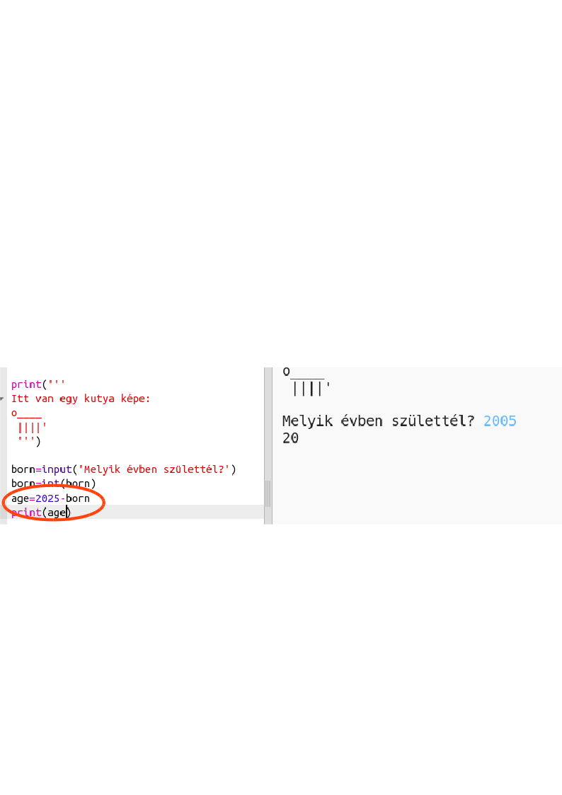

## A 2025-ös év

Számításokat és nyomtatási számokat is elvégezhet. Ismerd meg, mennyi idős lesz 2025-ben!

+ Annak kiszámításához, hogy mennyi idős lesz a 2025-ös év, akkor el kell vonnia az évet, amikor született 2025-től.
    
    Adja hozzá ezt a kódot a programhoz:
    
    
    
    Vegye figyelembe, hogy nem kell idézőjeleket tenni a számok köré. (Meg kell változtatnod a `2006` számot, ha egy másik évben született.)

+ Kattintson a ****futtatásra, és a programnak 2025-ben nyomtatnia kell az életkorát.
    
    

+ Javíthatja a programot a `bemenet ()` hogy megkérdezze a felhasználó életkorát, és tárolja egy **változó** nevű `született`.
    
    

+ Futtassa a programot, majd adja meg az évet, amikor született. Kaptál még egy hibaüzenetet?
    
    Ennek oka, hogy bármit írtak be a program **szöveg**, és meg kell átalakítani a **számú**.
    
    Használhatja `int ()` átalakítani a szöveget egy **egész**. Egy egész szám egy egész szám.
    
    

+ Más változót is létrehozhat a számítás tárolásához, és kinyomtathatja.
    
    

+ Végül könnyebben meg tudod érteni a programodat egy hasznos üzenet hozzáadásával.
    
    