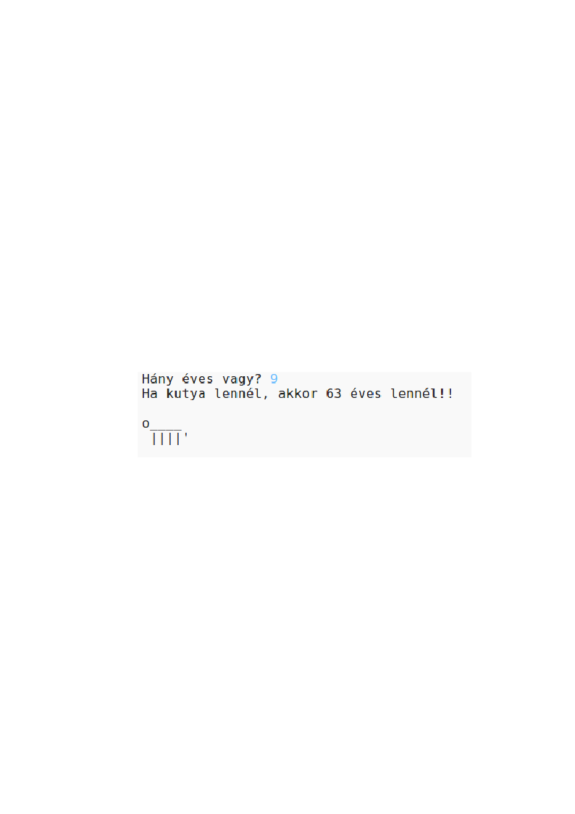

\--- kihívás \---

## Kihívás: az életkor a kutyaévekben

Írj egy programot, amely megkérdezi a felhasználó életkorát, majd elmondja nekik a korukat a kutyaévekben! A kutyaévekben kiszámíthatod az életkorát úgy, hogy korszakodat megszorozzuk 7-re.

A programozásnál a **szorzás** szimbóluma `*` karakter, amelyet általában a billentyűzeten a <kbd>Shift + 8</kbd> gomb megnyomásával írhatunk be.

\--- / kihívás \---