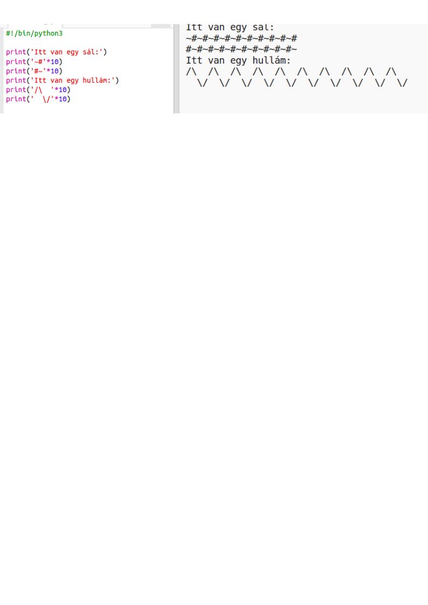

--- challenge ---

## Kihívás: a szöveg kiszámítása

Tudtad, hogy a szöveget is kiszámolhatod?!

Mit fog megjeleníteni a következő program a képernyőn? Lássuk, vajon ki tudod-e találni a választ a program futtatása előtt.

Te is ki tudsz találni ilyen szavakat? Még a saját mintáidat is elkészítheted!

--- /challenge ---

**Közösségi hozzájárulással készült fordítás**

Ezt a projektet **Csilla Szabo** fordította le és **Bence Vass** ellenőrizte.

A nagyszerű fordító önkénteseink segítenek, hogy világszerte megadhassuk a gyerekeknek a lehetőséget, hogy megtanuljanak kódolni. Ön is segíthet a projektjeink lefordításával, hogy több gyereket érhessünk el - bővebben az rpf.io/translators oldalon.