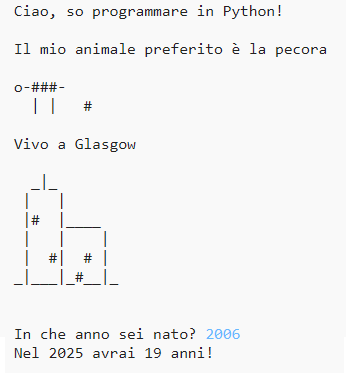

## Introduzione

In questo progetto, imparerai a creare un programma in Python che parla di te.

### Cosa creerai

  <iframe src="https://trinket.io/embed/python/a1f663ae0d?outputOnly=true&start=result" width="600" height="500" frameborder="0" marginwidth="0" marginheight="0" allowfullscreen>
  </iframe>
  

### Cosa imparerai

Questo progetto include elementi tratti dalle seguenti componenti del [Digital Making Curriculum di Raspberry Pi](http://rpf.io/curriculum){:target="_blank"}:

+ [Utilizzare i costrutti base di un linguaggio di programmazione per creare programmi semplici](https://www.raspberrypi.org/curriculum/programming/creator){:target="_blank"}

### Ulteriori informazioni per gli educatori

Se intendete stampare questo progetto, cliccate su [Versione stampabile](https://projects.raspberrypi.org/en/projects/about-me/print){:target = "_ blank"}.

Cliccare il link a piè di pagina per accedere alla repository di GitHub relativa a questo progetto, che contiene tutte le risorse necessarie (incluso un esempio di progetto completo) nella cartella 'en/resources'.