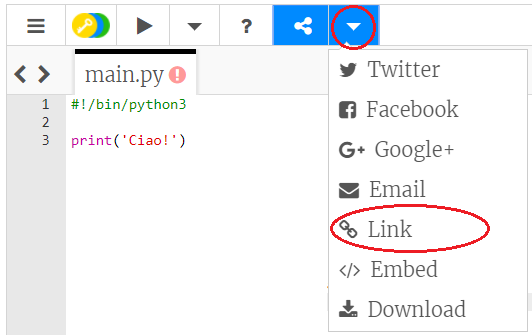

## Diciamo Ciao!

Cominciamo a scrivere del testo.

+ Apri il modello vuoto di Python Trinket: <a href="http://jumpto.cc/python-new" target="_blank">jumpto.cc/python-new</a>.

+ Nella finestra che appare scrivi:

    

    La riga `#!/bin/python3` dice a Trinket che stiamo usando Python 3 (l'ultima versione).

+ Premi "run" e dovresti vedere che il comando `print()` stampa (o visualizza) tutto il testo contenuto tra le virgolette (`' '`).

    

+ Se ha fatto un qualche sbaglio, apparirà invece un messaggio di errore che ti dice cosa c'è di sbagliato.

    Prova! Cancella le virgolette di chiusura `'` o la chiusura di parentesi `)` (o tutte e due) e prova a vedere cosa succede.

    

+ Rimetti le virgolette o la parentesi e fai clic su "run" per controllare che il tuo progetto funziona di nuovo.

__Non è obbligatorio avere un account su Trinket per salvare i progetti!__

Se non hai un account su Trinket, fai clic prima sulla freccia in giù e poi su "Link". In questo modo potrai salvare un link che potrai aprire più tardi. Dovrai eseguire questa procedura ogni volta che farai qualche cambiamento perché cambierà anche il link!

Se hai un account di Trinket, puoi cliccare "Remix" per salvare la tua copia personale del Trinket.

