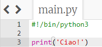
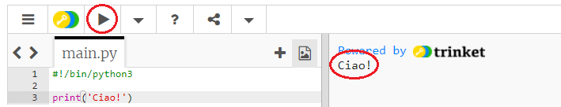
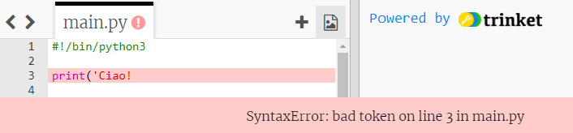
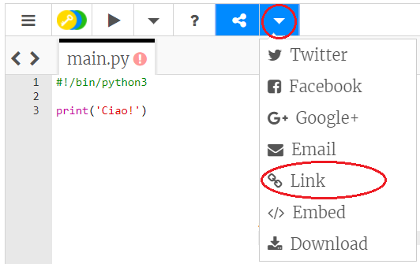

## Diciamo ciao

Iniziamo scrivendo del testo.

+ Apri un modello vuoto di Python su Trinket: <a href="http://jumpto.cc/python-new" target="_blank">jumpto.cc/python-new</a>.

+ Scrivi il seguente testo nella finestra che compare:
    
    
    
    La riga `#!/bin/python3` dice a Trinket che stiamo usando Python 3 (l'ultima versione di Python).

+ Fai click su **Run**. Vedrai che il comando `print()` "stampa" (cioè fa visualizzare) sulla pagina tutto il testo contenuto tra le virgolette `''`.
    
    

Se hai commesso un errore, riceverai un messaggio di errore che ti farà sapere cosa è andato storto!

+ Fai una prova! Cancella la virgoletta alla fine della citazione `'` o la parentesi alla fine `)` (o entrambe) e prova a vedere cosa succede.
    
    

+ Rimetti di nuovo al loro posto la virgoletta o la parentesi, e fai click su **Run** per far sì che il progetto funzioni di nuovo.

**Non hai bisogno di un account Trinket per salvare i tuoi progetti!**

Se non hai un account Trinket, fai click sulla freccia che punta verso il basso e clicca su **Link**. Questo comando ti darà un link che puoi salvare e che potrai aprire di nuovo più tardi. Dovrai fare questa cosa ogni volta che apporti delle modifiche al progetto, perché il link cambierà di volta in volta!

Se hai un account Trinket, puoi cliccare su **Remix** per salvare la tua copia del trinket.

