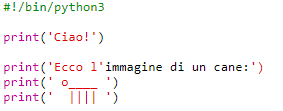
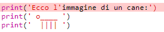
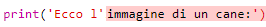
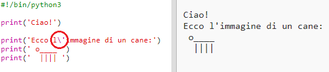
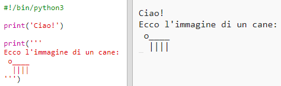

## Disegni ASCII

Proviamo a stampare qualcosa di molto più interessante che un semplice testo: i disegni ASCII! I disegni ASCII (pronuncia: '*ask-i*) sono delle **immagini create usando caratteri di testo**.

+ Aggiungiamo un bel disegno al tuo programma: aggiungiamo l'immagine di un cane!
    
    

Per realizzare le zampe del cane, utilizza la barra verticale `|`, che puoi digitare premendo <kbd>Shift + \ </kbd> (questo tasto si trova in alto a sinistra sulla tua tastiera).

+ Se fai click su **Run**, vedrai che c'è un problema con il tuo nuovo codice.
    
    
    
    Questo perché il tuo codice contiene un apostrofo `'`, e Python pensa che si tratti della fine del testo!
    
    

+ Per risolvere questo problema, basta inserire una barra rovesciata `` prima dell'apostrofo nella parola `l'immagine`. Questo dice a Python che l'apostrofo è parte del testo.
    
    

+ Se preferisci, puoi usare tre apostrofi `'''` invece di uno. Questo ti permetterà di stampare più righe di testo utilizzando il comando `print` una volta sola:
    
    