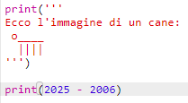
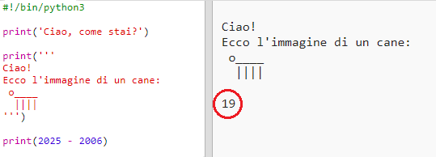
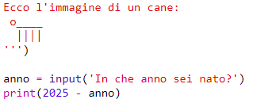
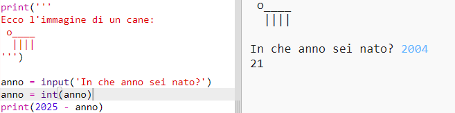
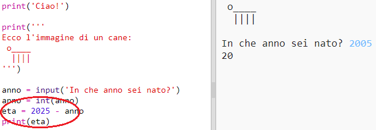
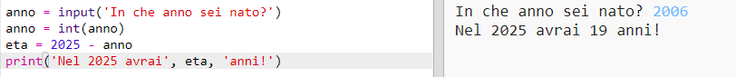

## Nel 2025

In questo programma, puoi anche fare dei calcoli e stampare dei numeri. Scopriamo quanti anni avrai nel 2025!

+ Per calcolare quanti anni avrai nel 2025, devi sottrarre il tuo anno di nascita da 2025.
    
    Aggiungi questo codice al tuo programma:
    
    
    
    Se ci fai caso, non c'è bisogno di inserire i numeri tra le virgolette. (Dovrai però cambiare il numero `2006` se il tuo anno di nascita è diverso.)

+ Fai click su **Run**. Il programma dovrebbe stampare quanti anni avrai nel 2025.
    
    

+ Puoi anche migliorare il tuo programma utilizzando l'istruzione `input()` per chiedere a chi lo usa quanti anni ha, e per conservare la sua età in una **variabile** chiamata `anno`.
    
    

+ Esegui il tuo programma e poi immetti l'anno in cui sei nato. Hai ricevuto un messaggio di errore?
    
    Questo succede perché tutto quello che viene digitato nel tuo programma è un **testo**, e questo testo va convertito in un **numero**.
    
    Puoi utilizzare `int()` per convertire il testo in un **integer**. Un "integer" è un numero intero.
    
    

+ Puoi anche creare un'altra variabile, la variabile "eta", per memorizzare il calcolo, e stampare questa variabile. Scrivi la parola "età" senza accento ("eta"), altrimenti comparirà un messaggio di errore.
    
    

+ Infine, puoi rendere il tuo programma più facile da capire aggiungendo un messaggio di aiuto.
    
    