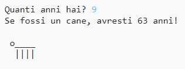

--- challenge ---

## Sfida: La tua età in anni canini

Crea un programma per chiedere agli utenti la loro età, e poi dirgli la loro età in anni canini! Puoi calcolare l'età di una persona in anni canini moltiplicando la loro età per 7.

In programmazione, il simbolo della **moltiplicazione** è l'asterisco `*`, che puoi digitare premendo <kbd>Shift + +</kbd> (il segno + si trova sulla tua tastiera accanto al tasto Invio).

--- /challenge ---