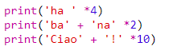
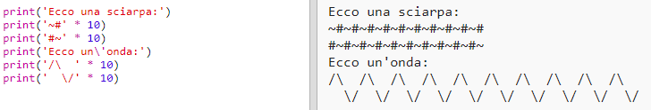

--- challenge ---

## Sfida: Calcolare un testo

Sapevi che puoi anche calcolare un testo?!

Cosa comparirà sullo schermo eseguendo questo programma? Vediamo se riesci ad indovinarlo prima di eseguire il programma.

Sapresti creare parole tutte tue? Puoi anche inventare disegni tutti tuoi!

--- /challenge ---
***
### Traduzioni della Community 

Questo progetto è stato tradotto da **Silvia Caponio** e revisionato da **Ivo Furano**. 

Il nostro straordinario team di traduttori volontari ci permette di dare ai bambini di tutto il mondo la possibilità di imparare a programmare. Puoi aiutarci a raggiungere più bambini traducendo i nostri progetti - scopri di più su [rpf.io/translators](https://rpf.io/translators).
