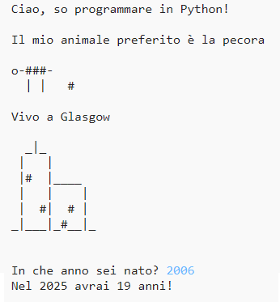

## Introduzione

In this project you will learn how to write a Python program telling people all about you.

### Cosa farai

  <iframe src="https://trinket.io/embed/python/a1f663ae0d?outputOnly=true&start=result" width="600" height="500" frameborder="0" marginwidth="0" marginheight="0" allowfullscreen>
  </iframe>
  

### Cosa imparerai

This project covers elements from the following strands of the [Raspberry Pi Digital Making Curriculum](http://rpf.io/curriculum){:target="_blank"}:

+ [Use basic programming constructs to create simple programs](https://www.raspberrypi.org/curriculum/programming/creator){:target="_blank"}

### Maggiori informazioni per educatori

Se hai bisogno di stampare questo progetto, si consiglia di utilizzare la [versione stampa ecologica](https://projects.raspberrypi.org/en/projects/about-me/print) {: target = blank"}.

Use the link in the footer to access the GitHub repository for this project, which contains all resources (including an example finished project) in the 'en/resources' folder.