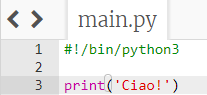
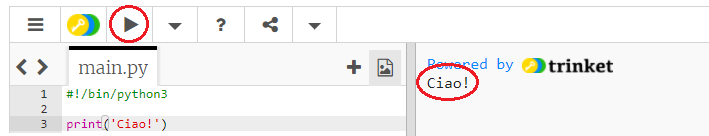
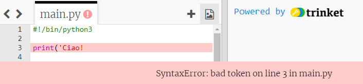
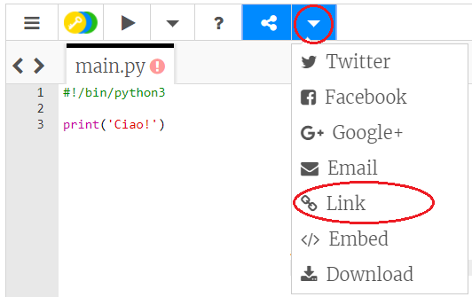

## Salutare

Iniziamo scrivendo qualcosa.

+ Apri un template Python vuoto: <a href="http://jumpto.cc/python-new" target="_blank">jumpto.cc/python-nuovo</a>.

+ Digita quanto segue nella finestra che apparirá:
    
    
    
    La linea `#! / bin/python3` dice solo a Trinket che stiamo usando Python 3 (l'ultima versione).

+ Clicca su **Run** e dovresti vedere che il comando `Print()` stampa tutto tra i segni di citazione `"`.
    
    

Se hai fatto uno sbaglio, apparirá un messaggio di errore che ti dice che cosa è andato storto!

+ Provalo! Elimina la citazione di fine `'` o la parentesi di chiusura `)` (o entrambi) e vedi cosa succede.
    
    

+ Add the quote or bracket back in, and click **Run** to make sure your project works again.

**You don't need a Trinket account to save your projects!**

If you don't have a Trinket account, click the down arrow and then click **Link**. This will give you a link that you can save and come back to later. You'll need to do this every time you make changes, as the link will change!

If you have a Trinket account, you can click **Remix** to save your own copy of the trinket.

