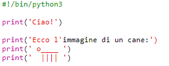
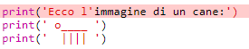
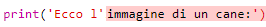
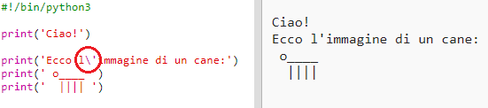
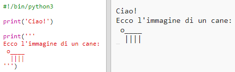

## I simboli ASCII

Stampiamo qualcosa di molto più divertente di un semplice testo: i simboli ASCII! I simboli ASCII (pronuncia: '*ask-i*') permettono di creare delle **immagini a partire da un testo**.

+ Aggiungiamo un po' di arte al tuo programma: un'immagine di un cane!
    
    

Per realizzare le zampe del cane, utilizza la barra verticale `|`, che puoi digitare premendo <kbd>Shift + \ </kbd> (questo tasto si trova in alto a sinistra sulla tua tastiera).

+ Cliccando **Run**, vedrai che c'è un problema con il tuo nuovo codice.
    
    
    
    Questo perché il tuo codice contiene un apostrofo `'`, e Python pensa che si tratti della fine del testo!
    
    

+ Per risolvere questo problema, inserisci una barra retroversa (o backslash) `` prima dell'apostrofo nella parola `l'immagine`. In questo modo Python saprà che l'apostrofo fa parte del testo.
    
    

+ Se preferisci, puoi usare tre apostrofi `'''` invece di uno. Questo ti permetterà di stampare più righe di testo utilizzando il comando `print` una volta sola:
    
    