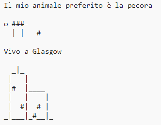

\--- challenge \---

## Challenge: Mi presento

Crea un programma Python per parlare agli altri di te usando del testo e i simboli ASCII. Puoi creare immagini dei tuoi hobby, dei tuoi amici o di qualsiasi cosa tu voglia!

**Ricorda che i codici che scrivi in ​​Trinket sono pubblici. Non condividere nessuna informazione personale come il tuo nome completo o il tuo indirizzo!**

Ecco un esempio:

\--- /challenge \---