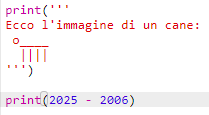
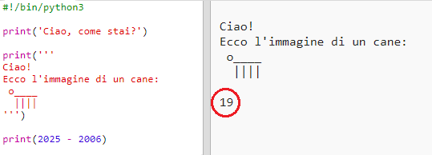
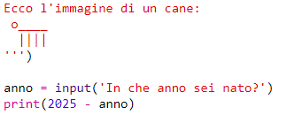
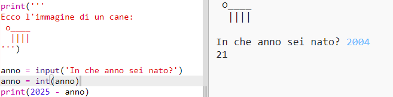
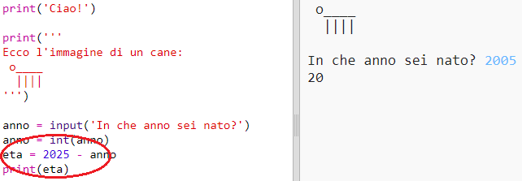
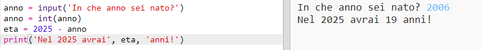

## L’anno 2025

Puoi anche fare calcoli e stampare numeri. Vediamo quanti anni avrai nel 2025!

+ Per calcolare la tua età nell’anno 2025, devi sottrarre il tuo anno di nascita da 2025.
    
    Aggiungi questo codice al tuo programma:
    
    
    
    Hai visto che non devi racchiudere i numeri tra virgolette? (Ricorda che devi cambiare il numero 2006 se il tuo anno di nascita è diverso)

+ Fai clic su “run” e il programma dovrebbe stampare la tua età nell’anno 2025.
    
    

+ Puoi anche migliorare il tuo programma usando l’istruzione “input()” per chiedere all’utilizzatore la sua età e memorizzarla in una variabile con il nome “born”.
    
    

+ Esegui il programma ed immetti il tuo anno di nascita. È apparso un messaggio di errore?
    
    Questo è perché tutto quello che viene digitato nel programma è testo, ma in questo caso deve essere convertito in numero.
    
    Puoi usare “int()” per convertire il testo in integer (la parola “integer” significa “numero intero”).
    
    

+ Puoi anche creare un’altra variabile in cui memorizzare il tuo calcolo e stampare quella invece.
    
    

+ Infine, puoi rendere il programma più facile da capire aggiungendo un messaggio di spiegazioni.
    
    